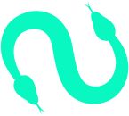

# @sallar-network/client

<p align="center">
    
</p>

## Description

Client-side library to communicate your program running on the [sallar network](https://sallar.io/) with your backend server.

## Installation

```bash
$ npm i @sallar-network/client
```

## Docs

```bash
$ npm run generate-docs
```

## Build

You can build and test the library on your own:

```bash
$ npm run build
```

And add to your project via npm:

```bash
$ npm link
$ npm link @sallar-network/server
```

or module js:

```js
import { InstanceManager } from './dist/index.mjs'
```

or window global object:

```html
<script src="/dist/index.global.js"></script>
```

## Example

`index.html`

```html
<!-- You have to include socket.io first -->
<script src="https://cdn.socket.io/4.7.2/socket.io.min.js"></script>

<!-- The library -->
<script src="/lib/index.global.js"></script>

<!-- Your program -->
<script type="module" src="/program.js"></script>
```

`program.js`

```js
const program = new SallarNetworkClient.InstanceManager(io);

program.on('say-hello', (_, manager) => {
    manager.emit('hello');
});
```

[See the server library](https://github.com/NERVE-labs-team/sallar-network-server-library)